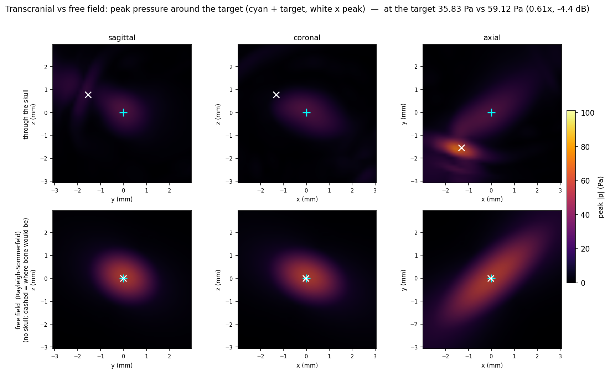

# Mouse — TIPS at 1 MHz on the middle of the cerebellum

The first mouse case on this branch: a whole-skull transparency map for a **cerebellum**
target in the Maga (UW 4K) dry-skull microCT, and the **TIPS** bowl (Philips Therapeutic
Imaging Probe and Sonication; 80 mm radius of curvature, 20.5–46 mm annular aperture,
8 rings) seated on it at **1 MHz**.

```bash
GPU=0 python run_mouse_tips_cerebellum.py        # solve + extract + place + report
```

Inputs come from the TUBA mouse pipeline (`tuba.species.mouse`), which already stages this
skull and its Allen CCFv3 registration — nothing new is scanned or registered here.

## The target

The middle of the cerebellum is the **centroid of the Allen CCFv3 cerebellum** (every
descendant of `CB`, id 512, in the Allen structure graph) warped into the skull's own
frame, at **maga RAS (−0.06, −11.60, 1.41) mm**: midline, 4.5 mm caudal of the brain
center the whole-skull baseline uses. The warped annotation recovers 40.8 mm³ of
cerebellum, and its whole-brain centroid agrees with the independently curated
endocranial-cavity centroid to **0.05 mm**, which is the check that the registration is
sound. The script recomputes the centroid at run time and asserts it against the recorded
constant.

## Two things a mouse changes

**Points per wavelength is set by bone thickness, not by the wavelength.** At 1 MHz the
water wavelength is 1.54 mm, so the human default of 6 ppw would give dx = 0.257 mm — but
the mouse calvaria is only ~0.2–0.5 mm thick, i.e. *one voxel*. This case runs **12 ppw
(dx = 0.128 mm)**, resolving the bone in 2–4 voxels; the domain is small enough
(252 × 292 × 212) that the solve still takes seconds. Human runs need no such bump because
their skull is ~7 mm thick.

**The placement footprint comes from the cone half-angle, not the aperture radius.**
`TransducerSpec.to_bowl_constraints` sets `bowl_radius_mm = aperture/2`, which is right for
a human — the skull sits about one focal length away, so the beam cone crosses it at
roughly the aperture radius — and wrong by more than an order of magnitude here:

| | radius on the skull | footprint |
|---|---|---|
| naive aperture radius | 46 mm | **100 %** of the skull |
| cone-derived, `r·sin(θ½)` | 3.4 mm | 6 % of the skull |

The mouse skull sits ~6 mm from the cerebellum while the TIPS focal length is 80 mm, so
the cone crosses it at 3.4 mm, not 46 mm. With the naive radius every candidate window
contains the entire 25 mm head, the window score goes flat, and the "optimum" it returns is
arbitrary (it lands on the opposite side of the head at a worse 32° incidence). The script
derives the footprint with `footprint_radius_mm()`; the packaged default is left alone so
human results do not move.

## Result

| | |
|---|---|
| window | maga RAS (−1.6, −12.9, 2.0) mm — interparietal/occipital bone, directly over the cerebellum |
| window-to-target | 2.1 mm (the mouse brain nearly touches the skull) |
| incidence | 34.3° (just inside the 35° acceptance angle) |
| access | 52 % of 4π of incidence-legal, well-transmitting skull |
| placement tolerance | the ≥90 %-objective lobe extends 4 mm |
| transparency spread | 19.7 dB between the 5th and 95th percentile patch |

> The incidence and access figures moved (from 24.6° and 54 %) on 2026-08-26. `place()` was
> building the transparency map with the packaged **2200 m/s** calvarial cutoff while the
> bundle, the solve and the extract all used this medium's own **1800 m/s**. The surface
> patches are unaffected — they come from the bundle — but `true_normals` re-derives the
> normals at that threshold, and on bone this thin and partial-volume-smeared the 2200 m/s
> normals tilt by ~10°. 34.3° is the number consistent with the rest of the pipeline. This
> is the same bug `skull-transparency place --bone-threshold` exists to prevent; the example
> now reads the cutoff off the bundle.

The ~20 dB spread is the point worth keeping: the mouse skull is *not* uniformly transparent
at 1 MHz even though the bone is far thinner than a wavelength (λ_bone = 2.9 mm, bone
≈ 0.3 mm) — sutures, the interparietal plate, and the basicranium still differ by more than
an order of magnitude in delivered intensity.

## What the report shows

`report_mouse_tips_cerebellum.pdf` (generated by the `place` step) opens with the placement
summary, then **the target in the skull**: sagittal / coronal / axial cuts through the
cerebellum, taken from the same sound-speed volume the solver used, with the Allen
cerebellum overlaid in green — plus a 3-D view of that structure inside the semi-transparent
skull with the chosen window and beam axis, the manuscript's Figure-1 scene rebuilt from the
bundle. The remaining sections follow the human reports: surface coupling, beam incidence
against the legality limit, the placement objective, ranked alternative windows, and methods.

It then carries **transcranial vs free field** (the table above plus the two focal fields
on one colour scale, over the skull itself: bone filled where it is really there, a dashed
outline in the free-field row where it was replaced by water — a clean focus on target
against the dimmer transcranial one whose peak sits on the inner table) and the **wave-propagation animation**: it plays inline in the HTML, and the PDF gets
an appended page built with LaTeX's `animate` package, so it plays in Acrobat exactly as
the manuscript's propagation figure does. Both sections appear only when their inputs
exist, so `place` still works on its own.

The anatomy section is generic: `write_report(..., bundle=bundle, atlas=<label volume>,
atlas_ids=<ids>)`. Without an atlas the target is drawn as a sphere; without a bundle the
section is skipped. Panels are framed on the head but cut through the target, and are
sampled in world mm, so they stay correct for any grid pose and either species' frame.

## Transcranial vs free field

`run_forward_comparison.py` drives the bowl forward twice on one grid — once through the
skull, once with the skull replaced by water — and compares the pressure at the target.
The bowl is the **real TIPS**: 80 mm radius of curvature, 92 mm aperture, f/0.87.

| | transcranial | free field |
|---|---|---|
| pressure **at the target** | 35.83 Pa | 59.12 Pa |
| peak anywhere in the ±3 mm box | 101.36 Pa | 59.15 Pa |
| distance of that peak from the target | 2.17 mm | 0.41 mm |

**Insertion loss at the target is 0.606× (−4.35 dB).** But the skull does not simply absorb
that energy — it *moves* it: the hottest point in the box is 1.7× brighter than the
free-field focus and sits 2.2 mm away, a coherent interference maximum rather than a
focus. At 1 MHz the mouse calvaria is a tenth of a wavelength thick, so it is a poor
absorber and a strong aberrator, which is the same story the ~20 dB spread in the
transparency map tells. Quoting the box maximum alone would report a spurious *gain*; the
at-target number is the one that doses the cerebellum.

Two checks that the pair is trustworthy: the free-field peak matches the analytic
focused-bowl gain (2π/λ)·R·(1−cos θ½) = 59.36 Pa per 1 Pa of surface drive to **0.3 %**,
and neither peak lies on the recording-box boundary.



Both rows share one colour scale, so they are read directly against each other: cyan `+`
is the target, white `×` the brightest point in the box. The free-field focus (bottom) is
round and centred on the target. Through the skull (top) it is dimmer, smeared, and the
brightest point has moved off target — the axial panel shows where the energy went
instead. There is no bone in these panels because the calvaria is ~6 mm away and the box
is only ±3 mm.

`make_forward_figure.py` regenerates this from **one** solve rather than two: only the
transcranial half needs the solver, and the all-water twin comes from `free_field_rs`.
On this deck that route reproduces the two-solve insertion loss to 0.05 dB (−4.40 vs
−4.35 dB) in about a third of the time. It writes `forward/focal_peaks.npz` — peak |p| per
box point — so the multi-GB traces can be deleted and the figure still redraws in a second.

### The substitute bowl this replaced, and what it got right

Until 2026-08-26 this section quoted an **18 mm** bowl instead — geometrically similar to
the TIPS (same 35.1° half-angle, same f/0.87) but short enough to fit. The full-size bowl
did not fit because `surround_mm` pads all six faces of the domain, so buying 80 mm of
stand-off with it cost `(head + 2·80)³` = 6.6 G cells and 147 GiB of medium maps at this
pitch. Sizing the domain to the union of the head and the transducer instead
(`build_brain_center_run(include_points_mm=...)`) puts the real bowl in 0.755 G cells —
8.7× smaller, and runnable. `SUBSTITUTE_BOWL=1` reproduces the old numbers.

The substitute turns out to have been a good one. Everything that depends on the f-number
and the incidence angles is reproduced; only the Fresnel number changes:

| | substitute, ROC 18 mm | real TIPS, ROC 80 mm |
|---|---|---|
| insertion loss at target | 0.60× (−4.4 dB) | **0.606× (−4.35 dB)** |
| hot spot / free-field focus | 1.74× | 1.71× |
| hot spot distance from target | 2.13 mm | 2.17 mm |
| free-field focus, proximal pull | 0.84 mm | **0.41 mm** |
| Fresnel number a²/λR | 3.9 | 17.2 |

So the old argument — that only the wavefront curvature at the bone differs, and that this
is second order for bone a tenth of a wavelength thick — was right, and is now measured
rather than argued. The one quantity it did get wrong is the free-field focal shift, which
is a property of the bowl's Fresnel number rather than of the skull: the stubby substitute
pulls its focus twice as far proximal as the real device does.

### Cross-check against the analytic twin

The free-field half of this pair is a bowl radiating into uniform water, which
`--free-field rs` integrates exactly instead of solving
(`skull_transparency.forward.free_field_rs`). On this deck it agrees with the full-wave
twin to **0.4 %** (59.38 vs 59.15 Pa) and gives the same insertion loss to 0.03 dB
(−4.38 vs −4.35 dB) — in **3.3 s** against ~40 min for the second solve.

That agreement is itself a resolution check. The saimiri case, the same comparison at
**6** PPW, has the two twins 3.9 % apart with the full-wave one low; here at **12** PPW the
gap is 0.4 %. Same physics, same code, finer grid.

Caveat: the hot-spot position is set by coherent interference, so it shifts with frequency,
pose, and drive bandwidth — treat 2.1 mm as "the peak leaves the target", not as a
reproducible coordinate.

## Caveats

- **The focus is longer than the cerebellum.** At f/0.87 and 1 MHz the TIPS focal spot is
  ~1.3 mm laterally but ~8 mm axially, against a cerebellum that spans 5.6 mm
  antero-posteriorly. Lateral targeting is selective; axial is not.
- **The central hole is not modelled.** `TransducerSpec` describes the TIPS as a filled
  annular bowl; the 20.5 mm inner radius affects the drive and side-lobe structure, not the
  window search (which depends only on the cone half-angle). The forward pair now uses the
  device's real focal length and real *outer* aperture, so this hole is what still separates
  it from the real annulus — it will raise the side lobes and narrow the main lobe relative
  to the numbers above.
- **Dry skull.** The specimen has no scalp or soft tissue, and the intensity ramp maps the
  (air-filled) cranial cavity to water — the standard choice for this dataset, but it means
  the model is a skull-in-water problem, not an in-vivo one.
- The report writes coordinates in the skull's own frame (`maga_aligned_native_ras_mm`) and
  omits the EEG 10-20 overlay, which is human-only; see the frame gating in `report.py`.

## Running it in Colab

[`notebooks/mouse_tips_cerebellum_colab.ipynb`](../../notebooks/mouse_tips_cerebellum_colab.ipynb)
reproduces this case on a free Colab GPU and downloads the same report at the end. The two
inputs it needs — the 200 µm sound-speed volume and the Allen annotation warped into the
skull frame — are ~7 MB together, staged in `runs/mouse_inputs_v1/` with checksums, and
fetched from whatever location `MOUSE_DATA_URL` points at.

Verified end to end: the notebook reproduced the numbers on this page exactly (window,
incidence, and the −4.4 dB at-target insertion loss) in about four minutes. It omits only
the propagation-movie section, which needs a volume-recorder re-run and a TeX installation.

> Stale as of 2026-08-26: that check predates both the calvarial-cutoff fix above and the
> switch to the real TIPS, and the notebook has not been re-run since. Expect its incidence
> to still read 24.6° until it reads the cutoff off the bundle the way `place()` now does.
