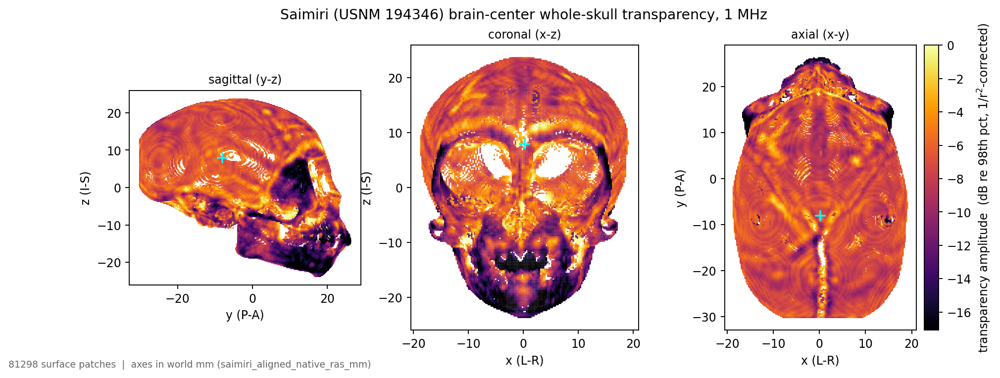

# Squirrel monkey (*Saimiri*) brain-center whole-skull transparency

A neutral, target-independent picture of **where the squirrel-monkey skull transmits
ultrasound at 1 MHz**. One omnidirectional time-reversal source sits at the center of the
cranial cavity and radiates in every direction; a single outward full-wave solve
illuminates the whole calvaria, and a `1/r²` correction cancels the residual geometric
spreading. What remains is a map of bone *transmission*. By reciprocity each surface patch
is also a **candidate transducer-element site**, and its recorded coupling is what an
element there would deliver to the brain center — which is what the napari positioning
tool shows.



---

## Inputs (tuba saimiri pillar — `../../../tuba/saimiri/registration`)

Museum microCT of *Saimiri sp.* (squirrel monkey), NMNH **USNM 194346**, MorphoSource media
000116521 (UTCT ACTIS; 0.0977 mm in-plane × 0.1189 mm slice, isotropised to ~98 µm by
`tuba.species.saimiri.downsample_to_working`).

**Genus confirmed independently of the label.** Size settles it without trusting any metadata:

| | *Saimiri* | *Macaca mulatta* | measured here |
|---|---|---|---|
| skull length (A–P) | 55–65 mm | 95–120 mm | **57 mm** |
| skull width (L–R) | 33–42 mm | 60–75 mm | **38 mm** |
| cranial capacity | 20–26 mL | 80–110 mL | **25.4 mL** |

A macaque would be 3–4× larger in every dimension. The VALiDATe29 atlas that registered
successfully to this cavity is also a squirrel-monkey atlas.

**Species is *not* settled**, and the upstream record contradicts itself: MorphoSource's
taxonomy field says *S. boliviensis*, while the same record's description and the DigiMorph
page it links (`digimorph.org/specimens/Saimiri_sciureus/194346/`) say *S. sciureus*. Nothing
in this case depends on which, so it is carried as *Saimiri sp.*

| input | source | value / note |
|---|---|---|
| sound speed `c` | `saimiri_skull_aligned_98um.nii.gz` | the ~98 µm aligned-native RAS intensity volume through the tuba `SLAB_RAMP` endpoints — `BONE_LOW` 6000 counts → water 1540 m/s, `BONE_RAMP_HIGH` 35000 counts → cortical bone 2900 m/s (both knees calibrated from this scan's own histogram) |
| brain center | `saimiri_cranial_cavity.nii.gz` | centroid of the curated endocranial-cavity mask (25.4 mL), saimiri aligned-native RAS **(0.23, −8.06, 7.91) mm** |
| bone cutoff | (this study) | **1700 m/s** — on this ramp the histogram bone knee sits exactly at water, so bone reads slow; 1700 m/s ≡ 9400 counts, inside the partial-volume shoulder between the mount/soft-tissue mode (≤ ~5000 counts) and the cortical plateau (≥ ~10000) |

The cavity mask is used rather than the image-only hole-fill because this is a **dry**
specimen, open at the foramina, where the hole-fill leaks (the human Halle / mouse lesson).

> ### ⚠️ Geometry only — the acoustics are not calibrated
> The museum scan is **not HU-calibrated**, so this uses tuba's explicitly-flagged
> *placeholder* ramp (`hu_acoustics.placeholder_ramp`, `.placeholder = True`).
> Shell shape, thickness, aperture and **window ranking** are real; the absolute sound
> speeds are nominal cortical-bone endpoints, not measured. Bind an HU-calibrated colony
> CT (`CT_CALIBRATION`) to make the numbers quantitative.

## Grid

1 MHz, 6 PPW → `dx` = 0.257 mm, grid **196 × 268 × 234** (12.3 M voxels), 17,317 recorder
patches, 81,298 dense surface patches. The calvarium measures **~1.1 mm** median bone path
from the brain center (independently consistent with the 1.0–1.5 mm literature value), i.e.
4–6 grid voxels through bone. Solve + extract take under a minute on one A6000.

## Reproduce

```bash
SCRATCH=/dev/shm/saim_bc GPU=0 python build_saimiri_braincenter.py all

skull-transparency transparency --bundle bundle --out transparency.png \
    --save-npz transparency_map.npz
GPU=0 python run_saimiri_forward.py              # transcranial vs free field  (~5 min)
GPU=1 python make_saimiri_propagation_movie.py  # propagation animation       (~5 min)
python run_saimiri_report.py                     # -> report_saimiri_braincenter.pdf (+ .html)

python saimiri_position_tool.py --build-cache    # mesh cache      (one-time, ~10 s)
python saimiri_position_tool.py --build-objfield # objective field (one-time, ~10 s)
DISPLAY=:0 python saimiri_position_tool.py       # drive the bowl
DISPLAY=:0 python view_saimiri_position_napari.py                # quick static look
```

`run_saimiri_forward.py` and `make_saimiri_propagation_movie.py` are optional — the report
picks them up if their outputs exist and skips those sections if not. Both import
`chosen_placement()` from the report script, so all three drive the *same* window rather than
each re-deriving one.

`skull-transparency place` on its own uses the aperture radius and no access mask, so it
answers a different question than the report — see below. `run_saimiri_report.py` and the
positioning tool share the cone-derived footprint and the same access mask, so the glow
field you steer by cannot recommend a window the report would reject: the tool seeds at the
report's window, reading 100 % of peak with the beam crossing one 0.8 mm bone layer.

## The positioning tool

`saimiri_position_tool.py` is a port of the human CTX-500 tool
(`runs/rebuild_6ppw_graded/ctx500_position_tool.py`, manuscript Appendix A) onto the **Field
Bundle**, so it drives any bundle rather than the hard-wired Halle medium. Arrow keys walk the
apex around the target sphere, `.`/`,` set the standoff, `t/g` and `y/h` tilt and yaw the aim,
`e` exports the pose plus a full-density cap for the TR pipeline. The skull is coloured by the
placement objective (`sqrt(J)` moving window), with a live score, docked ortho slices, and
`--selftest` / `--smoke` / `--screenshot` as in the original.

Everything human-specific is now derived rather than assumed:

| was hard-wired | now |
|---|---|
| `tuba.species.human` + `crop_lo_ds` | the bundle's `Registration` (and its `world_frame` label) |
| S/A/L axes for the Halle domain | derived from `R_mni_to_sim` — **Halle has anatomical left at `+axis0`, Saimiri at `−axis0`**, so copying the constants would have mirrored every azimuth |
| 1.38 GB `halle_c_graded.f32` | `bundle/skull_fullres_c.npy` (49 MB) |
| `BONE_C = 1600` | the bundle's `physics.bone_threshold` |
| per-target `surf_intensity.npz` | the bundle's own `TransparencyMap` |
| CTX-500 63.2 / 64 mm | `--roc-mm` / `--aperture-mm` (default 35 / 30) |
| three human targets on keys 1/2/3 | one target per bundle; repeat `--bundle` for keys 1..9 |

Two independent checks that it is wired up right: the objective peak lands at
`(4.2, −6.7, −4.4)` mm, matching `place_bowl`'s `(4.2, −6.2, −4.4)`; and `--selftest` confirms
the registration round-trips to 0 voxels, the derived axes are a right-handed RAS triad, and
elevation `+90` moves superior while azimuth `+90` moves anatomically left.

### One readout change the small skull forced

The human tool reads the placement score at the **first** bone the beam meets — correct on the
vault, where the first bone *is* the acoustic window. Seated ventrally on this skull the beam
crosses **six** bone layers (mandible, zygomatic arch and tympanic region) before reaching the
intended window, so the first-layer score reads 9 % of peak and looks inexplicably low. The
readout now reports the whole stack — `beam crosses 6 bone layers, 3.8 mm total` — so the
obstruction is visible rather than silently depressing the number. That is a real finding, not
a display bug: **the objective-peak window is not reachable with a 35 mm-ROC bowl**, which is
the same conclusion as the placement caveat below, arrived at independently.

`transparency`, `place`, `position`, `explore` and `report` all read the bundle's recorded
`physics.bone_threshold`, so the 1700 m/s cutoff travels with the bundle; `--bone-threshold`
overrides it.

## Where the transducer may actually go

`place_bowl` maximises **raw** delivered intensity, which is correct by reciprocity (it
already includes spreading) and the wrong answer on its own: the map covers bone no
transducer can be seated against. Unconstrained, it picks a **ventral basicranial** window —
best-coupled, and aimed straight through the animal's throat.

`skull_transparency.access` builds the `legal_mask` from criteria measured on this skull
rather than drawn by hand. On this bundle (ROC 35 mm, aperture 30 mm, 35° acceptance):

| criterion | what it rules out | patches dropped |
|---|---|---|
| `max_layers=1` | beam crosses the mandible, zygomatic arch or tympanic bulla before the window | 38,306 |
| `min_bone_mm=0.3` | thin foramen lips credited with energy that came out of a hole | 10 |
| `open_pad_deg=10` | the rim of an open aperture | 2,458 |
| `neck_cone_deg=45` | cones about every significant opening — the neck and pharynx lie beyond them | 8,238 |
| cap clearance | the dish itself would collide with bone | 883 |

**38.6 %** of patches survive, and the chosen window moves to the **vault**:
`(0.09, −8.77, 23.08)` mm, 15.2 mm from the target, incidence **15.9°** (was 33.7°).

### Finding the openings

The foramen exclusion cannot be a per-patch test. The map has **no patch inside the foramen
magnum** — there is no bone there to carry one — so a per-patch bone-path test structurally
cannot see it, and reports a clean skull. `escape_directions` instead casts rays over the
whole sphere from the target and measures the solid angle that leaves without meeting bone:

| opening | solid angle | half-angle | world axis | what it is |
|---|---|---|---|---|
| #0 | 1.38 % | 17° | `(0.03, −1.00, −0.07)` | **foramen magnum** (caudal) |
| #1 | 1.20 % | 14° | `(0.01, −0.34, −0.94)` | **basicranial gap** under the pharynx (ventral) |
| #2, #3 | 0.03 % each | 0° | — | single-ray specks (below the 0.5 % floor) |

**2.62 %** of the sphere is wide open. Guarding only the largest is not enough: the two are
separate clusters ~70° apart, and a window scoring well through #1 points at the throat. The
cone is applied to every opening above `neck_min_fraction`.

Nothing here is species-specific — the openings are measured, so the same call finds the
human foramen magnum or a rodent's. What it cannot know is **soft tissue**: this is a bare
dry skull, so scalp, pharynx and orbital contents are not modelled, and final accessibility
stays a protocol judgement.
