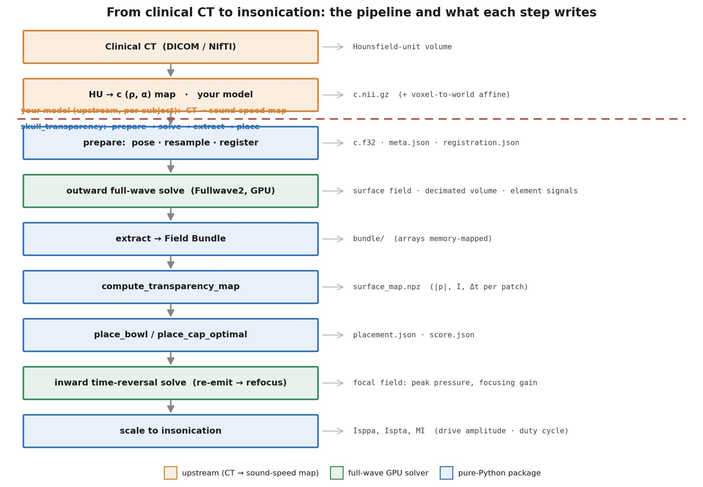
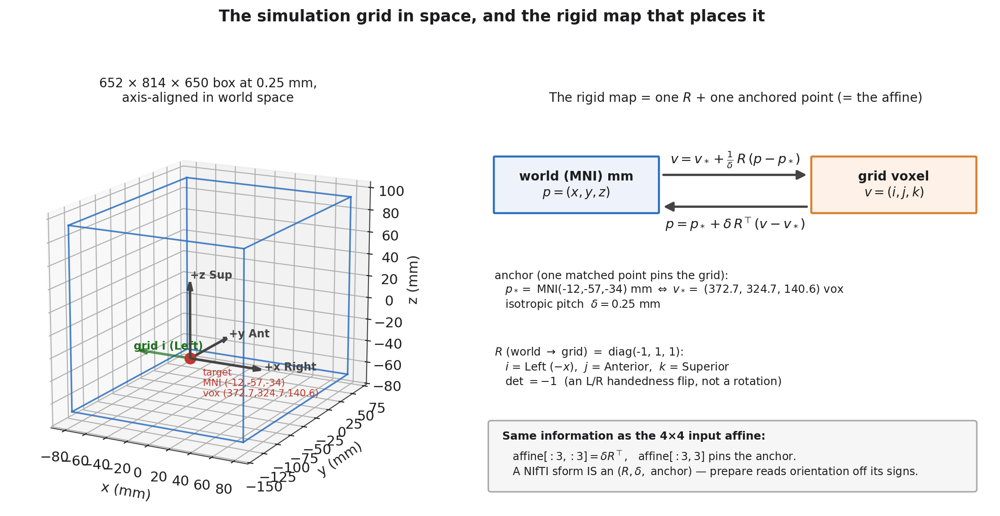
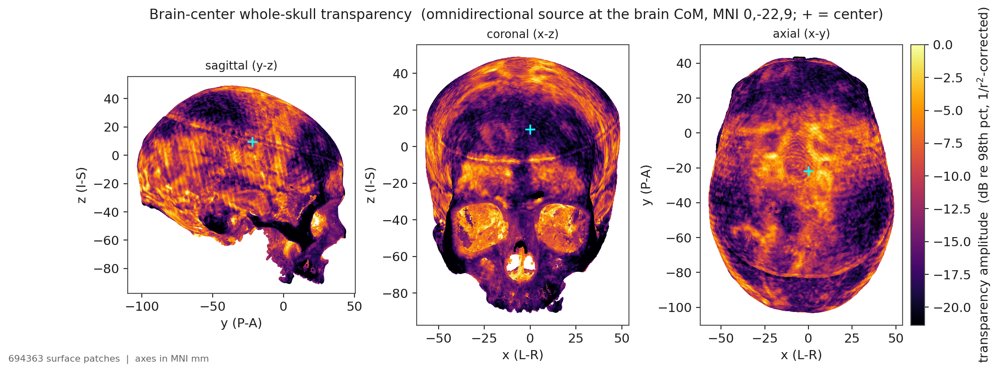
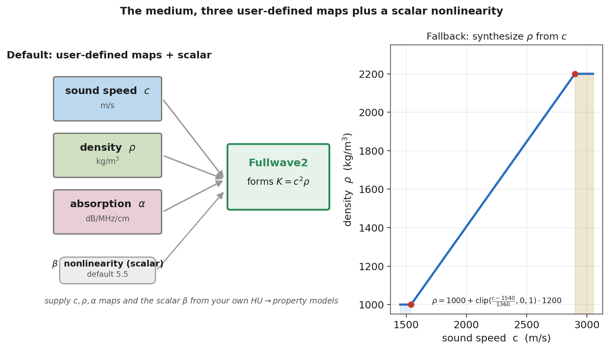
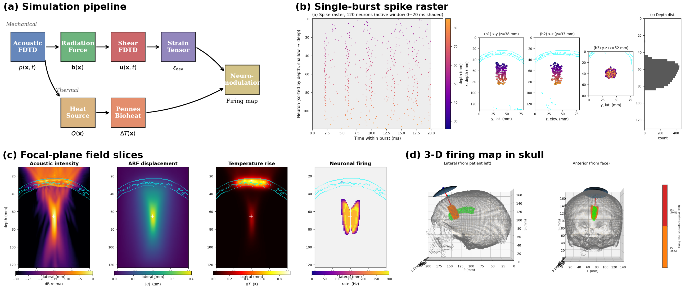

# The skull transparency targeting tool

*What it does, how the grid and target are defined, and how to bring your own CT*

## What the tool does

Given a subject's skull and a deep brain target, the tool finds **where to place a focused-ultrasound transducer, and at what pose**, to couple acoustic energy through the skull onto that target. It works by *acoustic reciprocity*: rather than search transducer positions by trial, it places a virtual point source *at the target* and runs one full-wave solve so the wave propagates **outward** through the skull, recording where it emerges on the outer skull surface and with what phase. Bright, in-phase surface patches are exactly the good acoustic windows; re-emitting that recording **time-reversed** converges back onto the target (Figure 1). The tool then searches that recorded surface for the best window and reports a concrete transducer placement plus a coupling score. The very same outward recording, taken from a source at the *center of the brain* rather than a target, instead gives a neutral **whole-skull** transparency map -- where the skull transmits, independent of any one target (Section 5).


*(animation, 135 frames — plays in the PDF; one representative frame is shown here.)*

**Figure 1.** Full-wave transcranial propagation (plays in Acrobat and compatible PDF viewers; otherwise one representative frame is shown). Grey = skull, cyan = the rigid occipital bowl, green $+$ = the dentate target. First the **outward** diverging wavefront sweeps from the target out to the full bowl; then the **inward** time-reversed re-emission converges back to refocus on the target. The outward pass records where the skull is acoustically "transparent", the data the tool reads to choose a window.

## The pipeline, end to end

The `skull_transparency` package is the pure-Python *consumer* end of a longer chain (Figure 2). It contains no DICOM segmentation or Hounsfield-unit code, since the boundary is the HU$\to$property mapping, not file I/O. Its world begins at the **medium maps** (sound speed $c$, density $\rho$, absorption $\alpha$) and their **voxel-to-world affine**, with a sound-speed map alone as the minimal fallback. A single `prepare` call then sizes and poses the grid, resamples the medium and writes the solver inputs; one outward GPU solve produces the surface recordings; and the pure-Python back half builds a bundle, computes the transparency map and places the transducer. The only irreducibly-yours piece is the HU$\to$sound-speed model, which is scanner-specific.



**Figure 2.** The data flow and the artifact each step writes. Orange is upstream (you supply the CT and its HU$\to c$ map); green is the full-wave GPU solver; blue is the pure-Python package. `prepare` is the ingestion door. It consumes a sound-speed map plus an affine and writes `c.f32`, `meta.json` and `registration.json`.

## How the grid is defined in space

We use as a concrete example the values in the manuscript whole-skull run (`halle_hemis_tr_6ppw`), with every number from its `meta.json`. (That run was a hand-cropped *anisotropic* box; the generic `prepare` path emits a cube sized from the bowl reach. The geometry is the same; only the crop differs.)

### The full-resolution grid and its samples in x, y, z

The domain is an **isotropic-pitch, skull-centred voxel grid**. It is *not* a cube. The three axes hold different numbers of samples.

| quantity | symbol | default value |
|---|---|---|
| samples $(i,j,k)$ | $N$ | **$652\times814\times650$** ($\approx3.45\times10^{8}$ voxels) |
| voxel pitch (isotropic) | $\delta$ | **0.25 mm** $= c_0/(f_0\cdot\mathrm{ppw})$ |
| physical extent | $N\delta$ | $163\times203.5\times162.5$ mm |
| center frequency | $f_0$ | 1.0 MHz |
| reference sound speed | $c_0$ | 1540 m/s |
| points per wavelength | ppw | 6.16 |
| absorbing boundary | attenuating | $+96$ voxels |

So the **samples in x, y, z differ**: $652$ along $i$ (left–right), $814$ along $j$ (anterior–posterior), $650$ along $k$ (superior–inferior). The *pitch* is the same 0.25 mm on all three axes; the *extent* is not, because the skull is longer front-to-back than it is wide. The graded sound-speed volume `halle_c_graded.f32` holds these $\approx3.45\times10^{8}$ float32 samples in Fortran order (1.38 GB); the GPU solver keeps fourteen such grids (56 B/voxel), about 28 GB with the $+96$-voxel attenuating boundary and a wrapping array, on one 48 GB GPU.

### Choosing frequency and resolution

The pitch is set by the *acoustics*, not by the CT. You choose the **frequency** $f_0$ (physical) and a target **ppw** ($\approx 6$, numerical); everything else follows, with the grid *size* derived from the physical extent, never typed in.

$$
\delta = \frac{c_0}{f_0\cdot\mathrm{ppw}}, \qquad
N_\text{axis} = \big\lceil \mathrm{extent}_\text{axis}/\delta \big\rceil .
$$

$\delta$ follows the wavelength, not the CT's resolution. `prepare` resamples the CT to $\delta$ (downsample if finer, interpolate if coarser). At fixed ppw the pitch scales as $1/f_0$ and the voxel count as $f_0^3$, so frequency is the binding feasibility lever.

| $f_0$ | $\delta$ | ppw | $N$ $(x,y,z)$ | GPU |
|---|---|---|---|---|
| 0.25 MHz | 1.0 mm | 6.16 | $163\times204\times163$ | 1.1 GB |
| 0.5 MHz | 0.5 mm | 6.16 | $326\times407\times325$ | 5.0 GB |
| **1 MHz** | **0.25 mm** | **6.16** | $652\times814\times650$ | **28.4 GB** |
| 2 MHz | 0.125 mm | 6.16 | $1304\times1628\times1300$ | 189 GB |

1 MHz already fills a 48 GB GPU; 2 MHz does not fit on one; the half-megahertz CTX-500 cases are an order of magnitude cheaper. The standalone `build_grid.py` reproduces this so you can size a run before committing a GPU.

```bash
$ python build_grid.py --f0 1e6 --ct-pitch 0.5
grid pitch delta    0.25 mm   = c0 / (f0 * ppw)
grid size N         652 x 814 x 650  voxels   (345 M)
GPU memory (+bnd)   ~28.4 GB   (56 B/voxel)
your CT (0.5 mm)   resample to delta: interpolate up 2x
```

### Where the box sits in space

The box is placed into world space by a rigid (orthonormal) map $R$ plus one anchored point $(p_*,v_*)$, which is exactly the information in a NIfTI affine (Figure 3). For the reference run the anchor is the left dentate nucleus, $p_*=\mathrm{MNI}(-12,-57,-34)$ mm $\Leftrightarrow v_*=(372.7,324.7,140.6)$ vox, with $R=\mathrm{diag}(-1,1,1)$, so the grid is **axis-aligned with anatomy** ($i$ Left, $j$ Anterior, $k$ Superior), the $\det=-1$ being a left/right handedness flip, not a rotation. Any orientation is legal, because the `prepare` path rotates your `--approach` vector onto $+Z$ and reads anatomical orientation straight off the sign and permutation of the affine, so no MNI is required. Because the whole skull and a wrapping array share this one domain, a single outward solve records the entire bone surface (the coupling map), a decimated interior volume (the focal spot) and the per-element signals (the phase) in one pass, with no truncation and no separate focusing model. In code, this map is the `Registration` dataclass in `registration.py` ($R$ as `R_mni_to_sim`, $\delta$ as `dx_mm`, the anchor as `target_mni_mm` and `target_fullres_voxel`), serialized to `registration.json`. The grid shape, `dent_grid` and `axis_map` live in `meta.json`.



**Figure 3.** Left, the $652\times814\times650$ box drawn in world (MNI) coordinates; axis-aligned, so the grid voxel axes (green, $i$ runs Left) coincide with the anatomical axes (black) up to the L/R flip. Right, the rigid map that places it, one orthonormal $R$ and one anchored point, which together are exactly the $4\times4$ input affine ($\mathrm{affine}[:3,:3]=\delta R^{\!\top}$, the translation pins the anchor).

## How the target is defined

A target is just a **point in world millimetres** plus an **approach direction**. You pass the target coordinate in whatever frame your affine uses (MNI RAS is typical) and a unit vector pointing from the target out toward the skin; `prepare` poses the grid so that approach is $+Z$, seats the recording surface on that side, and echoes the target's grid voxel into `meta.json` (`dent_grid`) so you can confirm placement. The three deep targets used to demonstrate the method (Figure 4) are the left dentate nucleus $(-12,-57,-34)$, the thalamus $(-12,-18,8)$ and the dorsal anterior cingulate $(-4,24,28)$, each localized in MNI and mapped into the skull by the rigid registration.


**Figure 4.** The three deep targets in the skull frame (semi-transparent skull, three views): the left dentate nucleus (cyan, posterior fossa), thalamus (gold, central) and dorsal anterior cingulate (magenta, anterior). Each is defined as an MNI point and mapped into the skull by the rigid map of Figure 3.

The single most common import bug is a flipped target, a sign error in the affine mirrors the skull, so a left-side target lands on the right. Always confirm `dent_grid` sits where you expect (seated in from the approach face, correct laterality) before trusting a result, because nothing throws, it just gives a quietly wrong answer.

## The brain-center whole-skull transparency baseline

Targeting a deep point answers *where to place the transducer for that target*. A complementary question is *how transparent is the skull everywhere*, independent of any one target. The tool answers it with a **brain-center** run: a single virtual point source at the center of the brain radiates **omnidirectionally**, so one outward solve illuminates the whole calvaria at near-normal incidence, and the $1/r^2$ distance correction (Section 8) cancels the residual geometric spreading. What remains is a map of bone *transmission* that is not biased toward any window or target (Figure 5) -- a neutral whole-skull baseline.

It runs through the same pipeline, with no target and no approach (the wave goes every way, so the unimplemented `approach='auto'` never arises):

```bash
skull-transparency prepare --c-map c.nii.gz --center --transducer ctx500.json --out run/
#  ... outward GPU solve + extract (Section 7) ...
skull-transparency transparency --bundle run/bundle --out transparency.png
```

`--center` sizes a cube around the whole head and seats the source at the brain center: the **atlas center of mass** when the medium is in (or registered to) MNI -- the canonical ICBM152 brain-mask centroid, MNI $(0,-22,9.5)$ mm, mapped in through the affine -- otherwise the **intracranial-cavity centroid** read straight from the speed map (`brain_center.py`; the image-only centroid is exact for an intact CT but only $\sim$2 cm accurate on a *dry* specimen skull whose vault is open, so prefer the atlas path when a registration exists). The `transparency` subcommand then computes the $1/r^2$-corrected map (`compute_transparency_map`, distance correction on by default) and renders it as transmitted amplitude in decibels (`render_transparency_surface`, the log-$|p|$ convention).



**Figure 5.** Whole-skull transparency for the reference Halle skull from a brain-center run ($694{,}363$ surface patches, three anatomical projections; bright $=$ acoustically transparent bone). Colour is the $1/r^2$-corrected transmitted *amplitude* in decibels relative to the $98$th-percentile window -- the whole-skull convention is log $|p|$, since linear intensity ($p^2$) has too wide a dynamic range and crushes most of the skull to black. One omnidirectional source sits at the atlas brain center of mass (cyan $+$, MNI $(0,-22,9)$; the field peaks $0.3$ mm from it), $29$--$111$ mm from the bone. The thin temporal squama reads transparent; the orbits read dark (openings, where intracranial air maps to water, Section 10). This generalises the deprecated whole-skull "center" launcher, whose source in fact sat at the dentate, $57$ mm off the brain center.

> **A baseline, not a placement objective**
>
> - The brain-center map is for *seeing* where the skull transmits; the $1/r^2$ correction over-rewards far, thin-bone windows, so it is the wrong quantity to seat a transducer with. For an actual placement use a targeted run and `place`, which weights incidence ($\cos^2\theta$) and hard-rejects sub-critical patches (Section 8).

## The medium maps for speed, density, and attenuation

The medium is three co-registered volumes (sound speed $c$, density $\rho$, absorption $\alpha$) plus a scalar nonlinearity $\beta$ (default 5.5); the solver forms only the bulk modulus $K=c^2\rho$ internally. **By default the maps and $\beta$ are user-defined** (Figure 6): you supply them with whatever HU$\to$property models you trust, since the right mapping depends on the scanner. The reference subject maps Hounsfield units to a piecewise-linear speed ($1540\to2900$ m/s) and density ($1000\to2200$ kg/m$^3$) and a CT-porosity absorption ($0.4$ dB MHz$^{-1}$ cm$^{-1}$ in soft tissue/water, rising in bone). When you supply only a speed map, `prepare` fills the rest. $\beta$ defaults to 5.5 (`meta.json` key `beta`), `--alpha-map` overrides the porosity model, `--rho-map` overrides the synthesized density, and otherwise $\rho$ comes from the ramp $\rho(c)=1000+\mathrm{clip}((c-1540)/1360,0,1)\cdot1200$. At the linear $1$ Pa drive used for the reference results $\beta$ has no effect; it is carried in the medium only for finite-amplitude runs.



**Figure 6.** The medium is three user-defined maps ($c$, $\rho$, $\alpha$) plus a scalar nonlinearity $\beta$ (default 5.5); the solver forms only $K=c^2\rho$. If only a speed map is available, $\rho$ can be synthesized from $c$ (right).

## Importing your own CT, step by step

The one irreducibly-yours piece is the HU$\to$sound-speed model; everything downstream is shipped.

1. **Build the medium maps (yours).** Map Hounsfield units to a sound-speed volume $c$ (m/s); optionally density $\rho$ and absorption $\alpha$. Save $c$ as a **NIfTI** (whose `sform` carries the affine) or a `.npy` plus a separate $4\times4$ affine.
2. **Pick a transducer spec.** A `TransducerSpec` JSON fixes the pitch and recording geometry, $\delta=c_0/(f_0\cdot\mathrm{ppw})$. Use the CTX-500 preset or give `f0_hz`, `roc_mm`, `aperture_mm`, `ppw`.
3. **Prepare the run (shipped).**
    ```bash
    skull-transparency prepare --c-map c.nii.gz --target -12,-57,-34 \
        --approach 0,0,1 --transducer ctx500.json --out run/
    ```

4. **Run the outward full-wave solve (GPU).** The Fullwave2 / `fullwave2-ultra` step; install the `.[solver]` extra and point `FULLWAVE2_BIN` at the binary. Section 8 covers the two-phase solve and how the acoustic field is computed from it.
5. **Extract and place (pure Python).**
    ```python
    import skull_transparency as st
    bundle = st.load_bundle("run/bundle")            # after `skull-transparency extract`
    tmap   = st.compute_transparency_map(bundle)     # per-patch coupling
    pl     = st.place_bowl(tmap, st.BowlConstraints(focal_length_mm=63.2))  # best window + pose
    ```

For a `.npy` c-map add `--affine A.npy`. `prepare` resamples to $\delta$, poses the grid, and writes `c.f32`, `meta.json`, `array_coords.i32` and a rigid `registration.json`. From the console, run `skull-transparency extract ...` then `skull-transparency place --bundle run/bundle --out result/`, which calls `place_bowl` exactly as above. (The manuscript's pose-optimised CTX-500 cap method is `place_cap_optimal`, which instead takes a `CapField` plus seed az/el angles.)

For a target-free **whole-skull** baseline, swap steps 3 and 5: `prepare --center` (no `--target`/`--approach`) seats the source at the brain center, and after the same solve+extract, `skull-transparency transparency --bundle run/bundle --out map.png` renders the $1/r^2$-corrected map (Section 5).

## Running the time-reversal simulation and computing the field

The solve has **two phases** (Figure 1 animates both). The **outward** phase places a virtual point source at the target and propagates it out through the skull, recording in one pass the field on the entire bone surface, a decimated interior volume, and the per-element array signals. The **inward** phase time-reverses that array recording and re-emits it, so the wave converges back and refocuses at the target, recording the focal field (Figure 7).

### Running the solve

`prepare` writes the sim tree (`c.f32`, `meta.json`, `array_coords.i32`); the solver is the external Fullwave2 / `fullwave2-ultra` binary (`bench_3d_opt`). The launcher layer writes the solver's `.dat` inputs (the medium maps $c$, $K=c^2\rho$, $\rho$, $\beta$ and the absorbing-boundary map, the source pulse and the recorder coordinates) and invokes it; without `--run` it only writes the inputs (a dry run):

```bash
export FULLWAVE2_BIN=/path/to/bench_3d_opt       # or install the .[solver] extra
python -m skull_transparency.sim outward          --sim run/ --out run/ --run --gpuid 0
python -m skull_transparency.sim inward_windowed   --sim run/ --out run/ --run --gpuid 0
```

The solver runs at CFL $0.2$; the outward record length is $\approx 1.84\,\lvert\mathbf{x}_\mathrm{array}-\mathbf{x}_t\rvert_{\max}/c_0$. Each phase writes `genout.dat` (the recorded channels and frames). The medium maps depend only on $(c,\text{grid})$, so the inward run hardlinks them from the outward run instead of rewriting $\sim$10 GB.

**Corrected vs. uncorrected re-emission.** The focal-box launchers take `--mode` to set the inward drive. `tr` (default) re-emits the recorded, time-reversed waveform, the *full* aberration correction; `geo` fires a geometric drive (per-element delay $\tau_i=(\max_j d_j-d_i)/c_0$ from the element-to-target distance, a homogeneous-medium assumption with *no* skull correction); and `flat` is a zero-phase drive (all elements fire in phase, no delay). Running `geo` or `flat` alongside `tr` and comparing focal peaks quantifies what the aberration correction buys.

```bash
python -m skull_transparency.sim subset_focalbox --mode geo  --selfile sel.i32 --sim run/ --out run/ --run
python -m skull_transparency.sim subset_focalbox --mode flat --selfile sel.i32 --sim run/ --out run/ --run
```

### Computing the field

From the outward record, `integrate_outward` forms, per grid voxel, the time-integrated intensity $\mathcal{I}=\sum_t p^2(t)$ (deposited energy) and the peak pressure $p_{\max}=\max_t\lvert p(t)\rvert$, which is dominated by the clean direct arrival. Sampling $p_{\max}$ just outside the bone surface within the direct-arrival (ballistic) window $t\le 1.12\,\lvert\mathbf{x}-\mathbf{x}_t\rvert/c_0$, the *raw* peak intensity $I=p_{\max}^2/(2\rho c)$ (geometric spreading included, so it is dominated by proximity to the target) is the coupling (transparency) map the placement search reads. The optional $1/r^2$ distance-corrected map is for *visualizing* bone transmission only; using it for placement over-rewards far, thin-bone windows -- it is exactly the neutral whole-skull baseline of Section 5 (rendered there as transmitted amplitude in dB). That search weights each patch by incidence ($\cos^2\theta$ on the true surface normal) and hard-rejects patches beyond $30^\circ$ (the water-to-bone longitudinal critical angle, past which the fluid solver's longitudinal transmission gives way to unmodeled shear conversion); the resulting incidence-weighted objective $\sqrt{J_w}$ is what the placement step and the interactive positioning tool maximize. The per-element aberration delays that steer the inward re-emission come from the array-element traces (each element's direct-arrival time), not from this surface map. From the inward record, the converged field gives the focal spot and the on-target peak relative to the 1 Pa per-element drive. For the reference dentate the dense $120^\circ$ occipital array (the validation aperture of Figure 7) refocuses as a near-wavelength spot ($-6$ dB FWHM $1.25\times2.5\times2.25$ mm) at $20.7\times$ the per-element drive. A single buildable bowl is weaker: the 64 mm transducer the placement step seats refocuses on the dentate at $7.9\times$, and the same procedure reaches $15.2\times$ at the thalamus and $11.4\times$ at the dACC through their own windows.


**Figure 7.** The transcranial focal spot at the dentate, computed from the inward re-emission at 1 Pa per-element drive (three orthogonal slices through the focal peak, dB relative to peak; white contour $=-6$ dB / FWHM). This is the field the inward phase produces; the outward phase produces the surface coupling map that chose the window.

### Scaling intensity to a neuromodulation insonication

The solve is *linear* and probes the skull with the canonical **two-cycle** transmit pulse, so what transfers is an amplitude **pressure gain** $G$ (focal peak pressure per 1 Pa of per-element drive, e.g. $20.7\times$ for the reference dentate's $120^\circ$ array; a single buildable bowl reaches $7.9\times$) and the field *shape*, both independent of pulse length. A neuromodulation insonication is instead a long tone burst at $f_0$, pulsed at a duty cycle $D=t_\mathrm{on}/t_\mathrm{period}$. Given a per-element drive amplitude $A$ (Pa), convert as

$$
p_\text{focus}=G\,A,\qquad
I_\mathrm{sppa}=\frac{p_\text{focus}^2}{2\rho c},\qquad
I_\mathrm{spta}=D\,I_\mathrm{sppa}.
$$

The peak pressure $p_\text{focus}$ and the pulse-average intensity $I_\mathrm{sppa}$ (the code's `peak_intensity`, W/m$^2$) are set by *amplitude only* and do not change with pulse length; **duration enters only through the duty cycle** $D$, in the time-average intensity $I_\mathrm{spta}$. Heating and thermal dose then scale as $I_\mathrm{spta}\times$ insonication time, while $\mathrm{MI}=\lvert p_-\rvert/\sqrt{f_0}$ stays peak-based. Two cautions apply. First, do *not* reuse the simulated $\sum_t p^2$ as a neuromodulation intensity, because it is the deposited energy of the two-cycle probe, not of your burst. Second, $G$ is the clean **direct-arrival** value, so a long continuous burst can accrue reverberant build-up the windowed estimate omits. Treat it as a lower bound and confirm with a CW / long-burst re-simulation if you need the steady-state focal pressure.

## Validating your import

A wrong or flipped registration does not throw; it gives a wrong answer. Five checks catch almost all of it.

1. **Target voxel.** Confirm `meta.json`'s `dent_grid` sits where you expect (in from the approach face, centred laterally).
2. **Eyeball slices.** Render the three orthogonal slices of `c.f32` through the target, and confirm skull where it should be, target inside brain, no edge wrap-around.
3. **Left/right.** A left-side target must land on the left; a mirrored skull is a sign error in `affine[:3,:3]`.
4. **Frame round-trip.** `--input-frame` is echoed into `meta.json`; read the output's `frame` key before trusting coordinates.
5. **No GPU?** Smoke-test install and placement on a synthetic skull with `python examples/synthetic/run_synthetic.py`.

If `prepare` raises, it is usually a units problem. *"no outer skull surface found"* means bone does not read $c>2200$ m/s (check your HU$\to c$ scale), and *"no skull surface within … of the approach axis"* means `--approach` points the wrong way (it must go target $\to$ skin).

## Limitations and caveats

- **Intracranial air is mapped to water.** Sinuses and mastoid air-cells read as water, so any window whose beam crosses them is not yet trustworthy. This is the most important caveat for real clinical CTs; deep solid-bone targets such as the dentate are unaffected.
- **The placement score overstates focusing gain.** The single-frequency surface integral $\sqrt{J}=\sqrt{\int_S|G|^2\,dS}$ is correct for *choosing* a window but overstates the broadband time-reversal gain and depth of field; quote those from the inward re-simulation.
- **`approach='auto'` is not implemented.** Pass an explicit `--approach` unit vector (target $\to$ skin), or use the brain-center mode (`--center`, Section 5), whose omnidirectional source needs no approach.
- **`prepare` sizes a cube.** It uses an $N^3$ grid from the bowl reach plus a margin rather than tightening to the head bounding box, which is correct but spends more voxels than the hand-cropped reference run.

## The interactive positioning tool

For a manual look, the console renders a placement preview (add `--interactive` for napari, which needs the `.[viz]` extra and a display):

```bash
skull-transparency position --bundle run/bundle --out preview.png
```

A richer manual tool (Appendix A of the PMB manuscript, `runs/rebuild_6ppw_graded/ctx500_position_tool.py`) renders the skull coloured by the placement objective $\sqrt{J_w}$ with a translucent CTX-500 cap and three orthogonal slices, with a live score as a percentage of the global peak (Figure 8). Keys are arrows = azimuth/elevation, `.`/`,` = radius, `t`/`g` and `y`/`h` = tilt/yaw, `1`/`2`/`3` = dentate / thalamus / dACC, `e` = export, `r` = reset. After a one-time `--build-cache` the caches make every later launch start with no large read.


**Figure 8.** The interactive positioning tool, shown for the dentate. Centre, the skull surface coloured by the placement objective $\sqrt{J_w}$ (dark to bright = low to high single-element coupling) with a translucent 64 mm bowl (cyan) on the occipital window, the target (green) and its geometric focus (magenta). Bottom, the same placement in three orthogonal slices through the target.

## Installation

The package is built in **two layers**, and most users only need the first. The **consumer** layer (placement from an already-solved bundle) is pure Python and needs no GPU and no external solver, so if you have a bundle you install the core and go straight to placement (Section 7, step 5). The **producer** layer (bringing your own CT) adds the one outward GPU solve, so it also needs the solver extra and a GPU.

```bash
pip install -e .                  # core: numpy, scipy (placement from an existing bundle)
```

> **Optional extras**
>
> - **`.[registration]`** (nibabel, tuba) reads NIfTI inputs and round-trips MNI / NRRD frames.
> - **`.[viz]`** (napari, matplotlib) drives the interactive positioning tool.
> - **`.[solver]`** (`fullwave2-ultra` plus a CUDA GPU) runs the outward solve. A 1 MHz whole-skull run fills a 48 GB GPU. Half-megahertz CTX-500 cases are an order of magnitude cheaper (Section 3).

\newpage

## Related downstream tool (not in this repo)

`acoustoelastic_ultrasound_neurons` extends this **multiphysics simulation stack** (coupling **acoustic** propagation, radiation-force **shear**-wave strain, **thermal** bioheat, the strain-to-membrane-tension **acousto-electric** transduction, and **neuronal** firing models on one anatomical grid) all the way to per-voxel neural firing. It does not ship with `skull_transparency` and is only a pointer to where this pipeline leads. The FUN 2026 conference abstract is reproduced verbatim below (its Fig. 1 is the composite shown in Figure 9).

**Background:** Transcranial focused ultrasound (tFUS) is a non-invasive neuromodulation modality with millimetre resolution and access to deep brain structures, yet its biophysical mechanism remains unresolved. Exposure is conventionally specified by transducer surface or derated focal pressure, quantities only indirectly related to what ultimately matters for therapy, namely which neurons fire and through which pathway they are recruited. No published tool carries an exposure prescription through to a per-voxel statement of firing, so competing mechanistic hypotheses cannot be compared on a common field. We present an open-source, end-to-end framework that maps a transcranial acoustic field to per-voxel neural firing maps registered to anatomy, with six interchangeable mechanism modules evaluated on one shared multi-compartment Hodgkin–Huxley neuron.

**Methods:** The pipeline (Fig. 1a) couples heterogeneous nonlinear full-wave acoustic propagation (Fullwave) through a micro-CT human-skull specimen, a radiation-force-driven viscoelastic shear-FDTD solve giving tissue displacement and strain, and a Pennes bioheat solve giving temperature rise. The mechanical pathway converts local tissue strain into an effective lipid-bilayer membrane tension, $T = K_A \cdot \alpha \cdot \varepsilon_\mathrm{eq}$, where $\varepsilon_\mathrm{eq}$ is the von Mises equivalent strain, $K_A$ is the bilayer area-expansion modulus, and $\alpha$ is a dimensionless multi-scale coupling factor relating far-field tissue strain to local membrane area change. This tension gates two-state Boltzmann mechanosensitive channels, a depolarising Piezo1 and a hyperpolarising TREK-1, on a dendrite-soma-AIS Hodgkin–Huxley neuron that also carries intramembrane-cavitation, Ca$^{2+}$/SK, thermosensitive (TRP), astrocytic (TRPA1 to glutamate to NMDA), and mechanosensitive-synaptic pathways. The product $K_A \cdot \alpha$ is the single operative calibration knob and is treated as a literature-bracketed modelling parameter. Every numerical parameter is classified by source and bracketed by a $\pm 25\%$ sensitivity sweep. We demonstrate the framework on the Yaakub theta-burst protocol (500 kHz CTX-500 array, 20 ms bursts at 5 Hz, 10% duty, 80 s session) delivered through the Halle micro-CT skull with the bowl auto-aimed at the left dorsal anterior cingulate cortex (dACC). The surface drive is calibrated to reproduce Yaakub's reported 0.5 MPa transcranial focal pressure.

**Results:** At the calibrated exposure (focal PNP 0.50 MPa, MI 0.71, $I_\mathrm{SPPA}$ 8.1 W/cm$^2$, the acoustic metrics remaining within ITRUSST consensus safety envelopes), the focal membrane tension reaches about 6.5 mN/m, roughly 2.4 times the Piezo1 half-activation tension, and the strain-driven Piezo1/TREK-1 pathway alone produces firing at 5,468 brain voxels at up to 300 Hz. The resulting iso-25% firing volume is 8,523 mm$^3$, substantially larger than the acoustic $-6$ dB focal volume (116 mm$^3$) and elongated along the beam axis by the focal aspect ratio (Fig. 1c). Focal heating is modest, with a focal $\Delta T$ of 233 mK and a skull-bone peak of 0.94 K. A real-field mechanism sweep (six strain levels by five scenarios) shows the dendrite-heavy three-compartment geometry is necessary for firing at the working point, where the single-compartment baseline stays subthreshold, while the Piezo1-inactivation/Ca$^{2+}$/SK pathway suppresses firing by about 30 to 33% (up to about 58% at saturation). Sensitivity analysis identifies the Piezo1 half-activation tension and the strain-to-tension product $K_A \cdot \alpha$ as the dominant uncertainties. End-to-end runtime is about 17 min per scenario on a single workstation for the fully volumetric, heterogeneous head model of roughly 28 million voxels over the 130 by 80 by 80 mm volume. By linking acoustic exposure to cellular firing, the framework is released open-source as a starting point for discriminating tFUS mechanisms against experimental recordings.



**Figure 9.** The FUN 2026 abstract's composite Figure 1, the end-to-end prediction for the Yaakub theta-burst sonication through the Halle micro-CT skull, aimed at the left dACC. (a) Simulation pipeline, acoustic FDTD $\to$ radiation-force / shear-FDTD strain and absorption / Pennes thermal, converging on the multi-pathway Hodgkin–Huxley neuromodulation block. (b) Single-burst spike raster across 120 firing voxels sorted by depth, with co-registered ROI slices and a depth histogram. (c) Co-registered focal-plane slices for acoustic intensity, radiation-force displacement, temperature rise, and firing rate (skull outline in cyan). (d) Three-dimensional iso-surfaces of the per-voxel firing rate (50% and 25% of peak) within the skull. Predicted 5,468 firing voxels, iso-25% firing volume 8,523 mm$^3$, focal $\Delta T$ 233 mK.

All numeric values above are taken from the whole-skull simulation metadata (`halle_hemis_tr_6ppw/meta.json`, cross-checked against the `halle_c_graded.f32` byte size) and the package source.
